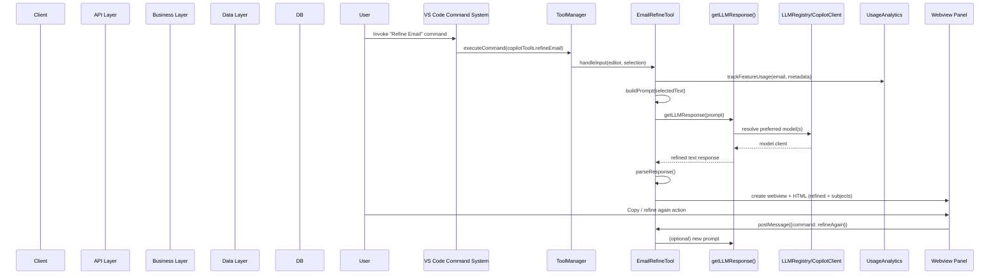

# Copilot-Powered Productivity Technical Onboarding Report

## 1. Project Overview
* **Project Type:** Developer Productivity VS Code Extension (LLM-assisted authoring & UML tooling)
* **Core Technology Stack:** TypeScript + VS Code Extension API + VS Code Language Model API (Copilot), esbuild build pipeline, Node.js ecosystem
* **Database & Persistence:** No external DB; local persistence via VS Code `globalState` (usage analytics, settings influence), ephemeral temp files for UML rendering
* **Key Dependencies:** `axios` (PlantUML JAR download), `marked` (markdown rendering in webviews), `mermaid` (diagram support roadmap), `uuid` (IDs), `esbuild` (bundling)
* **Initial Assessment:** Codebase is modular with clear tool abstraction (`BaseTool`, `ICopilotTool`, `ToolManager`). Strong focus on UX (status bars, auto-detection, webviews). Extensive PlantUML auto-config logic. Webview HTML repeated (opportunity for templating). Limited domain “data models” beyond analytics and tool types. Needs additional test coverage, security hardening (CSP, sanitize), and potential refactors for shared UI logic.

## 2. Core Business Domain
The extension’s domain is productivity augmentation inside VS Code: refining textual artifacts (emails, Jira issues), translating between English and Chinese, and generating / previewing UML diagrams (PlantUML now, Mermaid planned). The central business value is reducing cognitive friction for non-development tasks while integrating AI-assisted refinement inline with developer workflows.

Primary entities/processes:
- Tool abstraction: Each productivity function is a “tool” implementing a common interface (`ICopilotTool`) enabling easy extension (plug-in style).
- LLM mediation: Prompts are constructed per tool; responses parsed into structured presentation (refined content, subjects, translated text, UML diagrams).
- Analytics: Local-only privacy-conscious usage tracking enabling insights (feature frequency, function-level granularity) surfaced via an analytics dashboard.
- Diagram Operations: PlantUML rendering pipeline with auto-detected layout engine (Graphviz DOT vs Smetana fallback), status verification, and configuration workflow.

Processes revolve around: user text selection → command invocation → tool prompt + LLM response → rendered diff/preview webview → optional user action (copy, replace, export) → analytics logging.

## 3. System Design & Architecture
### 3.1. Directory Structure Analysis
```
root/
  package.json              # Extension manifest (commands, contributes, config)
  esbuild.js / tsconfig.json / eslint.config.mjs
  README.md / CHANGELOG.md / multiple design & improvement MD documents
  src/
    extension.ts            # Activation entrypoint; registers tools, status bars, auto-config
    tools.ts                # Re-exports core tool classes
    analytics.ts            # Usage analytics subsystem
    llm.ts                  # LLM model selection & fallback orchestration
    tools/
      base/
        baseTool.ts         # Abstract BaseTool (webview lifecycle, analytics hook)
        eventBus.ts, dependencyInjection.ts, lazyLoading.ts (framework scaffolding)
      email/emailRefineTool.ts
      translate/translateTool.ts
      jira/jiraRefineTool.ts
      uml/plantUMLPreviewTool.ts
      umlChatPanelRefactored.ts / umlChatPanel.ts # Chat-based UML designer
      analytics/analyticsDashboard.ts
      config/settingsWebview.ts / featureFlags.ts
      utils/dotPathDetector.ts / plantUMLDownloader.ts / helpers.ts
      preview.ts            # Local PlantUML rendering wrapper
      plugins/pluginSystem.ts (extensibility placeholder)
  docs/ & *IMPROVEMENTS.md  # Roadmaps, architecture, phased plans
```

### 3.2. Key Components and Their Interactions
- **Activation Layer (`extension.ts`)**: Orchestrates tool registration, PlantUML auto-detection, status bar managers (PlantUML engine + LLM model), analytics initialization, commands for settings/analytics.
- **Tool Framework**:
  - `ICopilotTool` interface + `ToolManager` (command binding & lifecycle).
  - `BaseTool` provides common UX flow (selection validation → prompt → LLM call → webview build → message handling).
  - Concrete tools (Email/Jira/Translate/PlantUML Preview) implement customization via prompt construction and HTML rendering.
- **LLM Layer (`llm.ts`)**: Preference-ordered model resolution (`copilotTools.llm.preferredModels`), fallback logic, Copilot vendor abstraction (`LLMRegistry`, `CopilotClient`).
- **Analytics (`analytics.ts` + dashboard)**: Local event capture (feature + function level), batching, optional sync placeholder, dashboard webview visualization.
- **Diagram Subsystem**:
  - Auto-detect Graphviz DOT vs Smetana fallback (`dotPathDetector.ts` + `autoConfigurePlantUML()`).
  - Status verification & UI feedback (status bar with mismatch warnings).
  - Preview rendering via `localRender.render` (PlantUML JAR) and webview for iterative editing.
- **Configuration & UX Enhancements**: Settings webview, quick picks for engine selection, multi-step detection feedback loops, onboarding notifications.
- **Extensibility Hooks**: Placeholder plugin system & DI scaffolding allow future tool injection without core modification.

## 4. UML Diagrams (Mermaid)

### 4.1. Core Domain Model
```mermaid
classDiagram
    direction LR

    class Extension {
      +activate(context)
      +deactivate()
      -getPlantumlJar()
      -autoConfigurePlantUML()
    }

    class ToolManager {
      -tools: ICopilotTool[]
      +registerTool(tool)
      +unregisterTool(cmd)
      +getTools()
    }

    class ICopilotTool {
      <<interface>>
      +command: string
      +title: string
      +isEnabled(cfg) bool
      +handleInput(editor, selection, settings)
      +getSettingsSchema()
    }

    class BaseTool {
      <<abstract>>
      #panel
      +handleInput(...)
      +buildPrompt()*
      +parseResponse()*
      +getWebviewHtml()*
      +handleWebviewMessage()*
    }

    class EmailRefineTool
    class TranslateTool
    class JiraRefineTool
    class PlantUMLPreviewTool

    class UsageAnalytics {
      -sessionId
      -pendingSyncQueue
      +trackFeatureUsage(...)
      +getCombinedUsageStats()
      +getDetailedMetrics(days)
    }

    class AnalyticsDashboard {
      -panel
      +show()
      -updateContent()
    }

    class LLMRegistry {
      +register(client)
      +get(name)
      +instance()
    }

    class CopilotClient {
      +send({prompt})
    }

    class llmFns {
      +getLLMResponse(prompt)
    }

    class DotPathDetector {
      +detectDotPath()
      +validateDotExecutable(path)
    }

    class PlantUMLStatusBarManager
    class LLMStatusBarManager

    Extension --> ToolManager : creates
    ToolManager "1" o--> "many" ICopilotTool : manages
    BaseTool <|-- EmailRefineTool
    BaseTool <|-- TranslateTool
    BaseTool <|-- JiraRefineTool
    ICopilotTool <|-- PlantUMLPreviewTool
    BaseTool ..> UsageAnalytics : trackUsage()
    PlantUMLPreviewTool ..> DotPathDetector
    Extension ..> DotPathDetector : auto-config
    llmFns ..> LLMRegistry
    LLMRegistry ..> CopilotClient
    BaseTool ..> llmFns : getLLMResponse()
    AnalyticsDashboard ..> UsageAnalytics
    Extension ..> PlantUMLStatusBarManager
    Extension ..> LLMStatusBarManager
```
*Diagram Explanation:* Extension activation composes the system: it instantiates `ToolManager`, registers concrete tools (deriving from `BaseTool` except the preview tool implementing interface directly), initializes analytics, LLM model selection, and PlantUML environment. Tools delegate AI calls to LLM utilities (`getLLMResponse`) which resolve clients via `LLMRegistry`. Analytics cross-cuts tool invocation. Status bar managers surface runtime configuration/state. PlantUML detection utilities support diagram rendering and engine verification.

### 4.2. Key API Flow Sequence

*Diagram Explanation:* A user command triggers the tool pipeline: command routing → tool invocation → analytics logging → prompt creation → model resolution/fallback → response parsing → webview presentation → iterative refinement loop via webview messages.

## 5. Identified Improvement Opportunities
* **Code & Design:**
  - Duplicate inline CSS/HTML across tool webviews (refactor to shared template or utility).
  - Missing central sanitizer / CSP; potential XSS risk when rendering LLM output (especially with `marked`).
  - `PlantUMLPreviewTool` bypasses `BaseTool` abstraction (either align or justify divergence).
  - Large monolithic `extension.ts` ( >1000 lines ) could be decomposed (activation phases, status bar modules, configuration flows).
  - Potential memory growth: analytics detailed metrics list can grow indefinitely (add pruning/retention policy).
* **Dependencies & Security:**
  - No Content Security Policy meta tags in webviews; script injection risks.
  - `marked` used without custom sanitizer; rely on `escapeHtml` inconsistently.
  - Auto-downloading PlantUML JAR via HTTPS without checksum / signature verification (supply chain risk).
  - Absence of dependency vulnerability scanning (recommend `npm audit` integration or GH Dependabot).
* **Performance:**
  - Repeated LLM calls in quick succession (refine loops) with no debouncing or cancellation token usage.
  - PlantUML engine verification spawns Java processes; could cache results more granularly or throttle.
  - Potential blocking I/O during JAR download (acceptable once but consider streaming progress with cancellation).
* **Testing & Maintenance:**
  - Lacks automated tests for prompt generation, parsing (e.g., subject extraction regex), and analytics persistence.
  - No integration tests around tool activation or fallback model selection.
  - Limited type guarding on dynamic webview message payloads.
  - Logging strategy spread across modules; introduce structured logger abstraction.
* **Observability & Diagnostics:**
  - Analytics limited to counts; no error rate tracking for LLM failures or PlantUML render failures.
  - No health command to surface aggregated diagnostics (engine, model availability).
* **Extensibility:**
  - Plugin system placeholder not yet integrated with discovery/registration lifecycle.
  - DI scaffolding present but not fully leveraged (tool construction manual).
* **Internationalization:**
  - Hardcoded English strings across UI; no i18n extraction mechanism.
* **User Experience:**
  - Inconsistent status coloring (warning color for Smetana might miscommunicate acceptable fallback).
  - Webview lacks diff mode for Email/Jira (README promises diff/split; code currently shows single refined output).
* **Configuration Robustness:**
  - LLM model selection lacks validation feedback if all preferred models fail (only warns).
  - No secure secret storage mechanism for API key beyond settings (if other LLM vendors added later).

## 6. Suggested Starting Tasks
* **Good First Issue:** Introduce a shared webview stylesheet + utility function to generate consistent container layout for all refinement tools (reduce duplication in Email / Jira / Translate).
* **Feature Enhancement:** Add optional diff view (original vs refined) for Email and Jira tools using a lightweight diff library, matching documented feature promises.
* **Refactoring Task:** Extract PlantUML auto-configuration & status bar logic from `extension.ts` into `src/tools/uml/plantumlConfigService.ts` reducing activation file size and improving testability.
* **Security Hardening:** Add CSP meta tags (`default-src 'none'; img-src data:; style-src 'unsafe-inline'; script-src 'nonce-...'`) and sanitize all LLM-rendered HTML (integrate DOMPurify in isolated module).
* **Testing Initiative:** Create Jest or Mocha test suite for:
  - Prompt builders (TranslateTool language detection cases)
  - Email subject extraction regex
  - Analytics retention & reset behavior
* **Observability Enhancement:** Log and expose counts of LLM failures and PlantUML fallback occurrences in analytics dashboard.
* **Supply Chain Safety:** Add SHA256 checksum verification for downloaded PlantUML JAR; store hash in globalState.
* **Performance Optimization:** Introduce cancellation tokens for in-flight LLM requests when user triggers a new refinement rapidly.
* **Extensibility Support:** Implement dynamic tool registration via `plugins/pluginSystem.ts` scanning a folder pattern, enabling drop-in tool modules.
