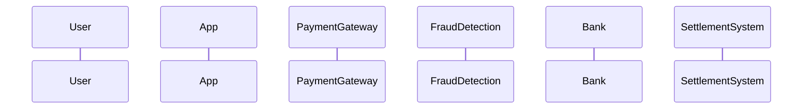
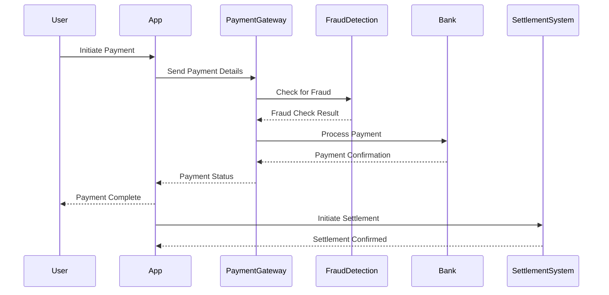

# Sequence Diagram Improvements

## Problem Identified

The AI was generating incomplete sequence diagrams that only included participant definitions but lacked actual sequence interactions. This resulted in Mermaid parsing errors:

```
Mermaid rendering error: Parse error on line 9:
...System    User-&gt;&gt;AuthSystem: Sub
---------------------^
Expecting 'SOLID_OPEN_ARROW', 'DOTTED_OPEN_ARROW', 'SOLID_ARROW', 'DOTTED_ARROW', 'SOLID_CROSS', 'DOTTED_CROSS', 'SOLID_POINT', 'DOTTED_POINT', got 'NEWLINE'

Debug Info:
sequenceDiagram
    participant User
    participant App
    participant PaymentGateway
    participant FraudDetection
    participant Bank
    participant SettlementSystem
```

The generated code was missing the actual sequence interactions (arrows and messages) between participants.

## Root Cause

The AI was generating sequence diagrams with:
- ✅ Proper `sequenceDiagram` declaration
- ✅ Complete participant definitions
- ❌ **Missing actual sequence interactions**
- ❌ No arrows or messages between participants
- ❌ Incomplete diagram content

## Solution Implemented

### 1. **Enhanced AI Prompt with Sequence Diagram Requirements**

#### **Detailed Sequence Diagram Guidance**
Added comprehensive requirements to the AI prompt:

```typescript
SEQUENCE DIAGRAM REQUIREMENTS:
- ALWAYS include actual sequence interactions after defining participants
- Use proper arrow syntax: ->> (solid arrow), --> (dotted arrow), -x (crossed arrow)
- Each line should show an interaction between participants
- Include meaningful messages for each interaction
- Show the complete flow from start to finish
```

#### **Specific Syntax Rules**
```typescript
CRITICAL MERMAID SYNTAX RULES:
- For sequence diagrams: 
  * Start with 'sequenceDiagram'
  * Define participants with 'participant <Name>'
  * MUST include actual sequence interactions using arrows (->>, -->, -x, etc.)
  * Each interaction should have a message: 'Participant1->>Participant2: Message'
  * Do NOT leave sequence diagrams empty after participant definitions
```

### 2. **Enhanced Syntax Validation**

#### **Component Tracking**
Added validation that tracks sequence diagram components:

```typescript
let hasSequenceDiagram = false;
let hasParticipants = false;
let hasInteractions = false;

// Check for sequence diagram declaration
if (line.includes('sequenceDiagram')) {
    hasSequenceDiagram = true;
}

// Check for participant definitions
if (line.includes('participant ')) {
    hasParticipants = true;
}

// Check for sequence interactions
if (line.includes('->>') || line.includes('-->') || line.includes('-x')) {
    hasInteractions = true;
}
```

#### **Incomplete Diagram Detection**
```typescript
// Check for incomplete sequence diagrams
if (hasSequenceDiagram && hasParticipants && !hasInteractions) {
    return {
        isValid: false,
        error: 'Incomplete sequence diagram: Missing sequence interactions after participant definitions'
    };
}
```

### 3. **Improved Error Messages**

#### **Specific Error Feedback**
- **Clear identification** of incomplete diagrams
- **Specific guidance** on what's missing
- **Helpful suggestions** for fixing issues

#### **Debug Information**
- **Code display** when errors occur
- **Line-by-line analysis** for troubleshooting
- **Context information** for understanding issues

## Technical Implementation

### 1. **MermaidGenerator Updates**
- **Enhanced system prompt** with sequence diagram requirements
- **Specific guidance** for sequence interactions
- **Arrow syntax examples** and requirements
- **Complete flow requirements**

### 2. **MermaidRenderer Updates**
- **Component tracking** for sequence diagrams
- **Incomplete diagram detection**
- **Specific error messages**
- **Validation improvements**

### 3. **Validation Logic**
- **Tracks three components**: declaration, participants, interactions
- **Detects missing interactions** after participant definitions
- **Provides specific feedback** for incomplete diagrams
- **Continues validation** for other syntax issues

## Benefits

### 1. **Complete Sequence Diagrams**
- **AI generates full diagrams** with interactions
- **Meaningful messages** for each interaction
- **Complete flow** from start to finish
- **Proper arrow syntax** throughout

### 2. **Better Error Detection**
- **Early detection** of incomplete diagrams
- **Specific error messages** for missing components
- **Clear guidance** on what needs to be fixed
- **Prevention** of rendering attempts on incomplete diagrams

### 3. **Improved User Experience**
- **Clear feedback** when diagrams are incomplete
- **Helpful error messages** with context
- **Debug information** for troubleshooting
- **Graceful handling** of validation issues

### 4. **Developer Experience**
- **Better error logging** with specific details
- **Component tracking** for debugging
- **Validation feedback** for improvements
- **Clear error categorization**

## Expected Behavior

### **Before Improvements**
- ❌ AI generated incomplete sequence diagrams
- ❌ Missing sequence interactions
- ❌ Mermaid parsing errors
- ❌ Unclear error messages
- ❌ No validation for completeness

### **After Improvements**
- ✅ AI generates complete sequence diagrams
- ✅ All interactions included with proper syntax
- ✅ Validation detects incomplete diagrams
- ✅ Clear error messages with specific guidance
- ✅ Prevention of rendering incomplete diagrams

## Testing

### **Automated Tests**
- **Component tracking validation**
- **Incomplete diagram detection**
- **Error message verification**
- **Prompt improvement validation**

### **Manual Testing**
- **Generate various sequence diagrams**
- **Test with complex requirements**
- **Verify validation and error handling**
- **Check complete flow generation**

## User Workflow

### **Normal Flow**
1. **User requests sequence diagram**
2. **AI generates complete diagram** with interactions
3. **Validation ensures completeness**
4. **Preview shows full sequence flow**
5. **User gets meaningful, complete diagram**

### **Error Flow**
1. **AI generates incomplete diagram**
2. **Validation detects missing interactions**
3. **Specific error message shown**
4. **User gets clear guidance** on what's missing
5. **System prevents rendering** of incomplete diagram

## Example Improvements

### **Before (Incomplete)**


### **After (Complete)**


## Conclusion

The sequence diagram improvements ensure that users get complete, meaningful diagrams with proper interactions. The system now provides better guidance to the AI, validates completeness, and gives clear feedback when diagrams are incomplete.

**Key Improvements**:
- ✅ **Complete diagrams**: AI generates full sequence interactions
- ✅ **Validation**: Detects and prevents incomplete diagrams
- ✅ **Clear feedback**: Specific error messages with guidance
- ✅ **Better guidance**: Enhanced AI prompt with requirements
- ✅ **Component tracking**: Validates all necessary parts
- ✅ **User experience**: Graceful handling with helpful feedback

The system now provides a robust, user-friendly experience for sequence diagram generation with complete validation and helpful error handling. 