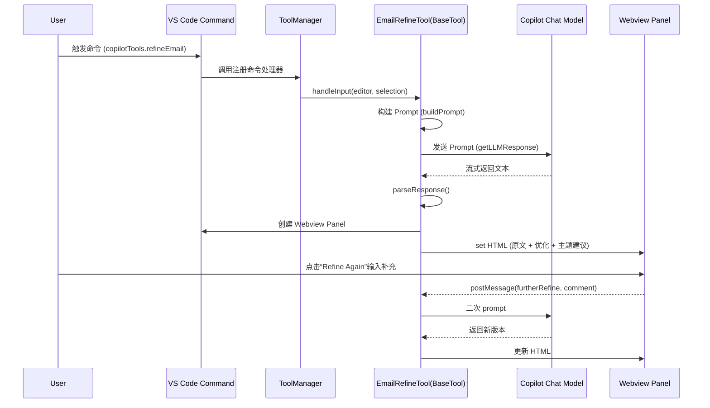
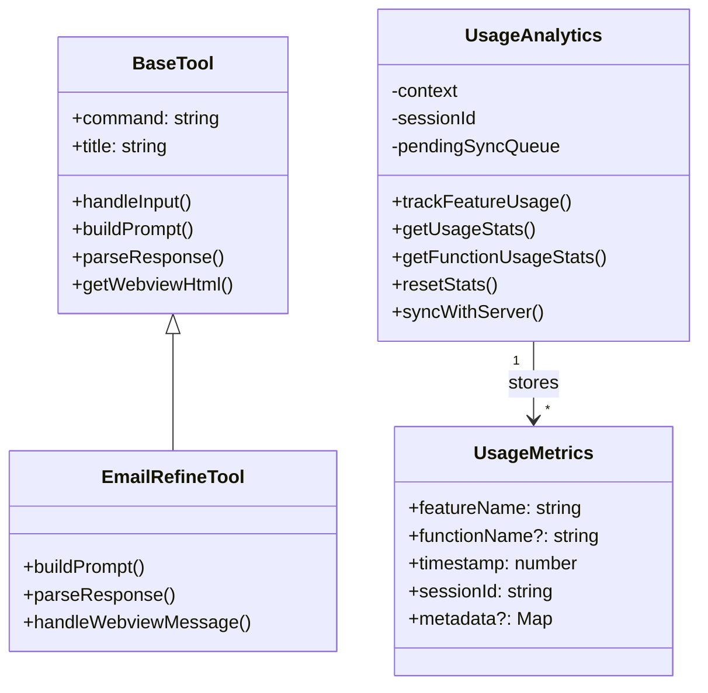
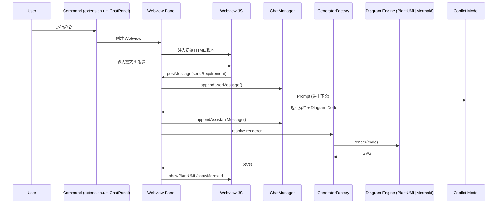
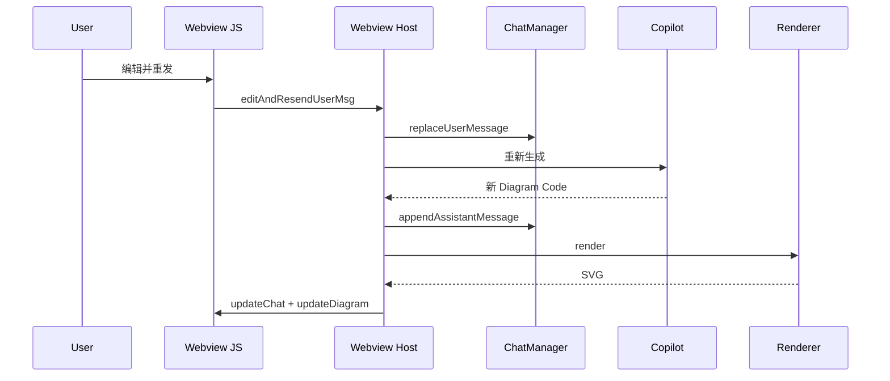
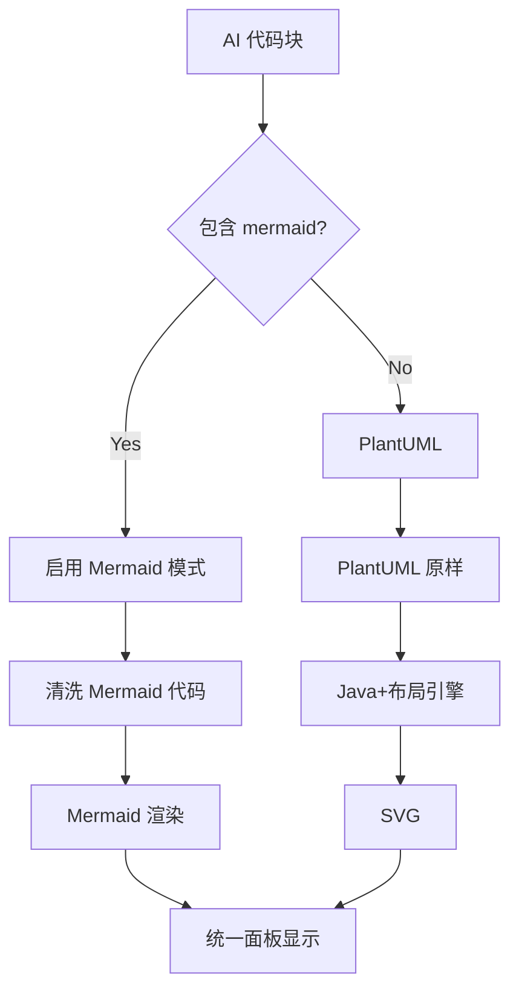
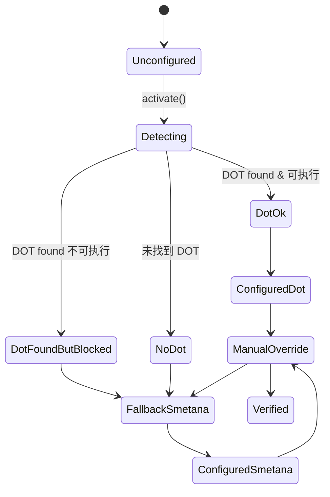
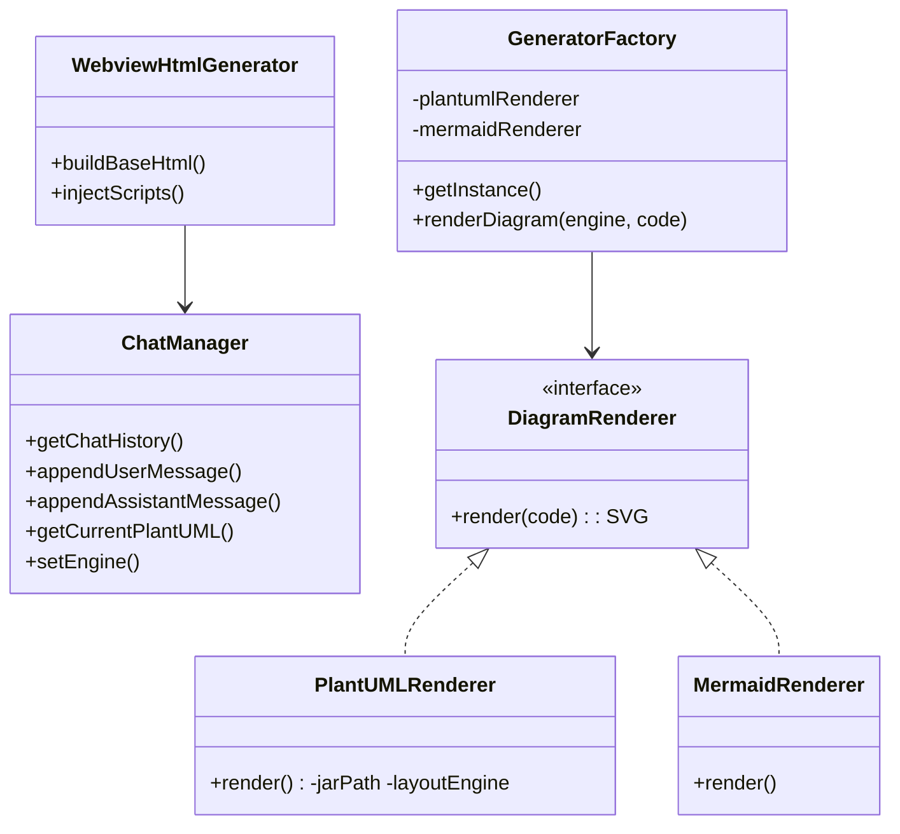
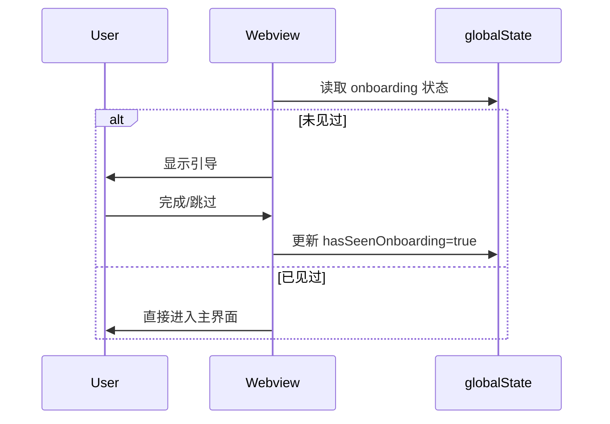

# 技术快速上手报告 (Technical Onboarding Report)

> 版本: 2025-08-09
> 项目: Copilot-Powered Productivity VS Code Extension
> 说明: 本文档整合前述全部分析（第 1~25 节），用于新成员/贡献者的快速理解与执行指南。

---
## 1. 项目概述 (High-Level Summary)
- **类型判定**: 基于 TypeScript 的 VS Code 扩展 (Productivity + AI 辅助 + UML 设计/渲染)。
- **核心功能**:
  - 文本处理与增强：邮件润色、Jira 描述结构化、英中双向翻译。
  - UML 能力：PlantUML 选区预览 + Chat 交互式 AI 驱动 UML 设计器（支持多轮需求 -> 代码 -> SVG 渲染）。
  - 自动 PlantUML 布局引擎探测与下载（Graphviz DOT / Smetana）。
  - 本地隐私友好型使用分析（Usage Analytics Dashboard）。
  - 模块化工具框架（新增工具易扩展）。
- **主要语言与运行时**: TypeScript + VS Code Extension API + Node.js (运行/打包)。
- **典型用户目标**: 提升开发/协作沟通效率 + 快速生成可视化设计（UML）+ 保障隐私与扩展性。

## 2. 技术栈深度解析 (Tech Stack Deep Dive)
来源: `package.json`
- **运行/语言**: TypeScript (编译为 JavaScript，esbuild 打包)。
- **VS Code API**: 命令、Webview、配置、状态栏、语言模型 (vscode.lm)。
- **LLM 集成**: Copilot Chat 模型 (vscode.lm.selectChatModels)。
- **Diagram**:
  - PlantUML (下载 JAR + Java 调用 + Graphviz DOT / Smetana 布局)。
  - Mermaid (实验性特性开关)。
- **HTTP**: axios（用于下载 `plantuml.jar`）。
- **Markdown 渲染**: marked。
- **可视化/潜在**: mermaid、@types/d3 (预留)。
- **UUID**: uuid（生成会话/用户标识）。
- **分析**: 自建 `UsageAnalytics`（本地存储 + 批量同步占位）。
- **构建/开发**: esbuild / typescript / eslint / @types/vscode。
- **测试框架**: @vscode/test-electron。

依赖作用简述（示例）:
- `vscode` - 扩展主 API。
- `axios` - HTTP 下载 (plantuml.jar)。
- `marked` - 将 LLM 输出 markdown 转 HTML。
- `mermaid` - 实验性图表引擎。
- `uuid` - 生成稳定标识。
- `esbuild` - 快速打包。
- `@vscode/test-electron` - 扩展测试宿主。

## 3. 架构与代码结构分析 (Architecture & Code Structure)
**架构模式**: Tool 插件策略 + Orchestrator，非 MVC；分层：命令注册层 / Tool 抽象层 / LLM 适配 / 渲染层 / 分析层 / UI (Webview)。

核心目录说明:
- `extension.ts` 入口：命令注册、ToolManager、PlantUML 自动配置、状态栏、Analytics 初始化。
- `tools.ts` 工具聚合导出。
- `tools/base/` 抽象基类、依赖注入、事件总线、懒加载。
- `tools/<email|jira|translate|uml>/` 具体工具实现。
- `tools/umlChatPanelRefactored.ts` UML Chat 主控制器。
- `tools/uml/` Diagram 渲染策略工厂 & 引擎。
- `tools/ui/` Webview 静态资源。
- `tools/utils/` dotPath 检测、下载器、通用 helpers。
- `analytics.ts` 使用分析系统。
- `llm.ts` 与 Copilot 模型交互。
- `preview.ts` PlantUML 选区预览。
- `tools/analytics/analyticsDashboard.ts` 分析仪表盘。

通用职责映射:
- 命令/入口：`extension.ts`
- 工具策略：`BaseTool` + 子类
- 业务逻辑：Tool prompt 构建 & 响应解析 & UML Chat Orchestration
- 集成服务：LLM、DOT 探测、Jar 下载
- 分析：UsageAnalytics
- 表现层：Webview + HTML 生成
- 配置与状态：VS Code `configuration` + `globalState`

## 4. 关键流程可视化 (Email Refine)


## 5. 数据模型初探 (Data Model Glimpse)
- **UsageMetrics**: `featureName`, `functionName?`, `timestamp`, `sessionId`, `metadata?`。
- **ChatMessage** (推断): 用户/AI 消息序列含 diagram code。
- **Diagram 源字符串**: PlantUML 或 Mermaid 代码。



## 6. 新人快速上手指南 (Newcomer's Quick Start Guide)
阅读顺序：`package.json` → `extension.ts` → `baseTool.ts` → 某个具体 Tool → `llm.ts` → UML Chat (`umlChatPanelRefactored.ts`) → `analytics.ts`。

运行:
- `npm install`
- `npm run watch`（含并行 tsc/esbuild）
- VS Code F5 启动开发宿主
- 打包: `npm run package`

主要命令 & 配置：见 `README.md` 与配置节。
调试: 在 `handleInput`、`getLLMResponse`、UML Chat 消息 switch 处打断点。

## 7. 关键业务流程选择理由补充
- 邮件润色流程代表标准 Tool 抽象 → Prompt → 解析 → Webview。
- UML Chat 增量复杂度高，可作为二级深入阅读对象。

## 8. 可扩展点 (Extension Points)
- 新增 Tool：继承 `BaseTool`，实现 buildPrompt/parseResponse/getWebviewHtml。
- LLM 抽象：封装 `getLLMResponse` → 支持多模型。
- Diagram 引擎扩展：扩展 `GeneratorFactory`。
- Analytics 扩展：向 `trackFeatureUsage` 增补 metadata。

## 9. 质量与改进建议 (Quick Wins)
- LLM 请求超时与重试策略。
- Webview HTML 模块化与安全消毒。
- Analytics 数据量上限控制。
- Mermaid 支持抽象统一渲染管线。

## 10. 行动总结 (Summary)
当前已具模块化与自动配置优势，后续重点在抽象接口、缓存、错误分层、性能与多模型支持。

---
## 11. UML Chat Designer 核心交互流程
### 11.1 主生成循环


### 11.2 编辑历史消息再生成


### 11.3 引擎选择逻辑


### 11.4 布局引擎自动配置状态机


## 12. UML Chat 子系统类图


## 13. Onboarding 教学流程


## 14. 诊断与扩展切入点
- 性能：渲染缓存 / 进程复用 / 丢弃中间态。
- 安全：统一 sanitize HTML。
- 测试：Mock LLM + Mock Renderer。

## 15. 新增“代码摘要工具”示例思路
1. 复制 `emailRefineTool` → `codeSummaryTool`。
2. Prompt: “Summarize selected code (responsibilities, key functions, improvement suggestions).”
3. 解析段落 + 建议列表。
4. 注册 command + 配置 toggle。

## 16. 风险与建议优先级
| 类别 | 风险 | 建议 |
| ---- | ---- | ---- |
| 异常 | LLM 超时未区分 | 增加超时与错误码 |
| 安全 | Webview 直插 HTML | DOMPurify 统一过滤 |
| 维护 | 大块模板字符串 | 模板文件化/前端打包 |
| 性能 | Java 多次启动 | 进程池 / 缓存 SVG |
| 数据 | Analytics 无限增长 | 上限 + 滚动窗口 |

## 17. 深入阅读顺序
`generatorFactory` → `chatManager` → `webviewHtmlGenerator` → `dotPathDetector` → `analyticsDashboard` → Mermaid flags。

## 18. 渲染性能优化蓝图
优先级: P0 缓存 → P1 渲染折叠 → P2 Java 进程复用 → P3 自适应 debounce → P4 AST 差分。

## 19. 可测试性与 Mock 策略
抽象接口: `LLMClient`, `DiagramRenderer`；注入模式；HTML snapshot；状态 InMemory；DOT 探测适配层。

## 20. 错误枚举表
| Domain | Code | 场景 | 提示 | 恢复 |
| ------ | ---- | ---- | ---- | ---- |
| LLM | LLM_TIMEOUT | 超时 | 提示重试 | 重试按钮 |
| LLM | LLM_EMPTY | 空响应 | 修改输入 | 重发 |
| Render | RENDER_JAVA_MISSING | 无 Java | 安装指引 | 打开文档 |
| Render | RENDER_DOT_BLOCKED | DOT 不可执行 | 已回退 | 查看状态 |
| Render | RENDER_SYNTAX | 图语法错误 | 高亮错误 | 提供修复建议 |
| Config | CFG_INVALID_DOT_PATH | 路径无效 | 重新配置 | 清除路径 |
| IO | IO_SAVE_FAIL | 导出失败 | 重试 | 选择新路径 |
| Analytics | ANALYTICS_DISABLED | 禁用 | 静默 | - |
| State | STATE_ONBOARDING_LOAD | 状态损坏 | 重置 | 重建状态 |
| Generic | UNKNOWN | 未知异常 | 一般错误 | 日志上报 |

## 21. 可观测性增强
- OutputChannel 分级日志
- 渲染耗时统计 & 百分位
- 缓存命中率指标
- 诊断命令汇总环境/状态

## 22. 扩展路径
| 方向 | 说明 | 试点 |
| ---- | ---- | ---- |
| 新工具 | PR Review / Code Summary | 复用 BaseTool |
| 多模型 | Copilot + 自托管 | LLMClient 抽象 |
| 上下文摘要 | 长历史压缩 | Sliding summary |
| 语法辅助 | LLM 后校验 | 规则+修复提示 |
| 协作 | Chat 导出共享 | JSON schema 版本化 |

## 23. 新贡献者 Checklist
- [ ] 安装依赖 & 启动 watch
- [ ] F5 启动开发宿主
- [ ] 试用核心命令
- [ ] 验证 UML Chat + 状态栏
- [ ] 打开 Analytics Dashboard
- [ ] 创建测试 Tool
- [ ] 记录实验到 README (可选)

## 24. 30/60/90 计划 (Roadmap Suggestion)
| 时间 | 目标 |
| ---- | ---- |
| 30d | 抽象 LLM/Renderer + 错误码 + SVG 缓存 |
| 60d | Java 进程复用 + 渲染队列 + 测试基线 + 诊断命令 |
| 90d | 多模型支持 + Diagram 增量 diff (实验) + 新工具 (Review/Summary) |

## 25. 行动优先建议 (Actionable Priorities)
1. 缓存 + 错误体系 + LLM 抽象
2. 渲染折叠 & 进程复用
3. 安全与模板规范化
4. 多模型扩展与可观测性

---
**后续**: 若需生成实现草图（如 Renderer 缓存接口、错误处理骨架），继续提出具体主题。

---
## 26. 实现蓝图与骨架 (Implementation Blueprints & Skeletons)
### 26.1 错误码与集中处理框架
建议新文件: `src/core/errors.ts`
```ts
// src/core/errors.ts
export enum ErrorCode {
  LLM_TIMEOUT = 'LLM_TIMEOUT',
  LLM_EMPTY = 'LLM_EMPTY',
  RENDER_JAVA_MISSING = 'RENDER_JAVA_MISSING',
  RENDER_DOT_BLOCKED = 'RENDER_DOT_BLOCKED',
  RENDER_SYNTAX = 'RENDER_SYNTAX',
  CFG_INVALID_DOT_PATH = 'CFG_INVALID_DOT_PATH',
  IO_SAVE_FAIL = 'IO_SAVE_FAIL',
  STATE_ONBOARDING_LOAD = 'STATE_ONBOARDING_LOAD',
  UNKNOWN = 'UNKNOWN'
}
export interface AppError extends Error { code: ErrorCode; details?: any; userMessage?: string; }
export function createError(code: ErrorCode, message: string, details?: any, userMessage?: string): AppError {
  const err = new Error(message) as AppError; err.code = code; err.details = details; err.userMessage = userMessage; return err;
}
```
集中处理: `src/core/errorHandler.ts`
```ts
import * as vscode from 'vscode';
import { ErrorCode, AppError } from './errors';
export class ErrorHandler {
  static handle(err: unknown, context?: string) {
    const appErr: AppError = normalize(err);
    log(appErr, context);
    notify(appErr);
  }
}
function normalize(err: unknown): AppError {
  if (typeof err === 'object' && err && (err as any).code) return err as AppError;
  return { ...(err instanceof Error ? err : new Error(String(err))), code: ErrorCode.UNKNOWN } as AppError;
}
function log(err: AppError, context?: string) { console.error(`[ERR][${err.code}]${context? '['+context+']':''}`, err.message, err.details); }
function notify(err: AppError) {
  const actionable = new Set([ErrorCode.LLM_TIMEOUT, ErrorCode.RENDER_JAVA_MISSING, ErrorCode.RENDER_DOT_BLOCKED, ErrorCode.CFG_INVALID_DOT_PATH]);
  if (!actionable.has(err.code)) return; // 避免噪音
  const msg = err.userMessage || `发生错误: ${err.code}`;
  const actions: string[] = [];
  if (err.code === ErrorCode.RENDER_JAVA_MISSING) actions.push('安装指南');
  if (err.code === ErrorCode.CFG_INVALID_DOT_PATH) actions.push('重新配置');
  vscode.window.showErrorMessage(msg, ...actions).then(sel => {
    if (sel === '安装指南') vscode.commands.executeCommand('vscode.open', vscode.Uri.parse('https://plantuml.com/zh/starting'));
    if (sel === '重新配置') vscode.commands.executeCommand('copilotTools.configurePlantUML');
  });
}
```
集成点: 在 `getLLMResponse` / 渲染 / DOT 检测处 `try/catch` → `ErrorHandler.handle(err,'LLM')`。

### 26.2 LLM 抽象层
文件: `src/core/llm/llmClient.ts`
```ts
export interface LLMRequest { prompt: string; temperature?: number; system?: string; }
export interface LLMResponse { text: string; raw?: any; }
export interface LLMClient { send(req: LLMRequest): Promise<LLMResponse>; name(): string; }
```
Copilot 实现包装原逻辑: `copilotClient.ts`
```ts
import * as vscode from 'vscode'; import { LLMClient, LLMRequest, LLMResponse } from './llmClient';
export class CopilotClient implements LLMClient { name(){return 'copilot';}
  async send(req: LLMRequest): Promise<LLMResponse> { const [model] = await vscode.lm.selectChatModels({ vendor:'copilot'}); if(!model) throw new Error('No Copilot model');
    const messages = [req.system? vscode.LanguageModelChatMessage.System(req.system): undefined, vscode.LanguageModelChatMessage.User(req.prompt)].filter(Boolean) as any;
    const r = await model.sendRequest(messages, {}, new vscode.CancellationTokenSource().token);
    let out=''; for await (const f of r.text) out+=f; return { text: out, raw: r };
  }
}
```
工厂 + 注册（支持多模型）:
```ts
export class LLMRegistry { private static inst: LLMRegistry; private impls = new Map<string, LLMClient>();
  static instance(){ return this.inst ??= new LLMRegistry(); }
  register(client: LLMClient){ this.impls.set(client.name(), client); }
  get(name: string){ return this.impls.get(name); }
  getDefault(){ return [...this.impls.values()][0]; }
}
```
迁移: `getLLMResponse(prompt)` → 调用 `LLMRegistry.instance().getDefault().send({prompt})`。

### 26.3 DiagramRenderer 缓存包装
新增: `src/tools/uml/cache/diagramCache.ts`
```ts
export interface DiagramCacheEntry { svg: string; engine: string; codeHash: string; createdAt: number; }
export class DiagramCache { private store = new Map<string, DiagramCacheEntry>();
  constructor(private max = 100) {}
  get(key: string){ return this.store.get(key); }
  set(key: string, entry: DiagramCacheEntry){ if(this.store.size >= this.max){ // 简单 FIFO
      const firstKey = this.store.keys().next().value; this.store.delete(firstKey);
    } this.store.set(key, entry); }
  key(engine: string, code: string){ return engine+':'+hash(code); }
}
function hash(str: string){ let h=0,i=0,len=str.length; while(i<len){ h = (h<<5)-h + str.charCodeAt(i++) |0; } return h.toString(16); }
```
装饰器: `cachedRenderer.ts`
```ts
import { DiagramRenderer } from '../types';
import { DiagramCache } from './diagramCache';
export class CachedRenderer implements DiagramRenderer {
  constructor(private inner: DiagramRenderer, private engine: string, private cache: DiagramCache){}
  async render(code: string){ const key = this.cache.key(this.engine, code); const hit = this.cache.get(key); if(hit) return hit.svg; const svg = await this.inner.render(code); this.cache.set(key,{svg,engine:this.engine,codeHash:key,createdAt:Date.now()}); return svg; }
}
```
在 `GeneratorFactory` 初始化时包一层缓存。命中率可写入 Analytics。

### 26.4 PlantUML Java 进程管理
目标: 减少多次 `java -jar` 启动。实现单 worker。
`src/tools/uml/plantuml/plantumlProcess.ts`
```ts
import { spawn, ChildProcessWithoutNullStreams } from 'child_process';
interface Job { code: string; resolve: (v:string)=>void; reject: (e:any)=>void; }
export class PlantUMLProcessPool { private proc?: ChildProcessWithoutNullStreams; private queue: Job[]=[]; private busy=false;
  constructor(private jarPath: string, private args: string[] = []){}
  private ensure() { if(this.proc) return; this.proc = spawn('java', ['-Djava.awt.headless=true','-jar',this.jarPath, '-pipe', '-tsvg', ...this.args]);
    this.proc.stderr.on('data', d=> console.warn('[plantuml]', d.toString()));
    this.proc.on('exit', ()=> { this.proc=undefined; }); }
  render(code: string){ return new Promise<string>((resolve,reject)=>{ this.queue.push({code,resolve,reject}); this.tick(); }); }
  private tick(){ if(this.busy) return; const job = this.queue.shift(); if(!job) return; this.ensure(); this.busy=true; let out='';
    const onData = (d:Buffer)=> out+=d.toString(); const onEnd = ()=>{ cleanup(); this.busy=false; job.resolve(out); this.tick(); };
    const onErr = (e:any)=>{ cleanup(); this.busy=false; job.reject(e); this.tick(); };
    const cleanup = ()=>{ this.proc?.stdout.off('data', onData); this.proc?.stdout.off('end', onEnd); };
    this.proc!.stdout.once('end', onEnd); this.proc!.stdout.on('data', onData);
    this.proc!.stdin.write(job.code); this.proc!.stdin.end(); // 简化: 每次 diagram 结束会触发 stdout end → 可改为分隔协议
  }
}
```
注意: 上述是概念草图，真实实现需使用分隔符协议 (`@startuml`/`@enduml`) 而非关闭 stdin 重启。

### 26.5 渲染请求折叠 (Drop Intermediate)
简单策略:
```ts
class RenderScheduler { private pending: {code:string, resolve:(s:string)=>void, reject:(e:any)=>void} | null=null; private running=false;
  constructor(private doRender:(code:string)=>Promise<string>){}
  schedule(code:string){ return new Promise<string>((resolve,reject)=>{ this.pending={code,resolve,reject}; this.tryRun(); }); }
  private async tryRun(){ if(this.running || !this.pending) return; this.running=true; const job=this.pending; this.pending=null; try{ const svg= await this.doRender(job.code); job.resolve(svg);}catch(e){ job.reject(e);} finally { this.running=false; if(this.pending) this.tryRun(); } }
}
```
集成: UML Chat 更新时用 `scheduler.schedule(diagramCode)` 代替直接 renderer.render。

### 26.6 诊断命令 (Diagnostics)
命令: `copilotTools.diagnostics`
输出:
- Java 可执行: yes/no (版本)
- DOT 配置: configured vs 实际 fallback
- 缓存: 命中率 (需在缓存层计数)
- 最近错误: 内存环形缓冲 (ErrorHandler push)
实现步骤:
1. ErrorHandler 增加 `recent: AppError[]`。
2. DiagramCache 增加 hit/miss 计数。
3. 注册命令 → 组装 markdown → `showInformationMessage` 或 Webview。

### 26.7 Analytics 指标增强
新增字段:
- `render.cache.hit` / `render.cache.miss`
- `render.time.ms` (分桶: <200, <500, <1000, >=1000)
- `llm.response.len` (字符区间)
更新方式: 在缓存装饰器、渲染前后、LLM 返回后调用 `trackUsage('metric', { key:'render.time.ms', bucket:'<500' })` 或设计专用 API。

## 27. 推出与迁移策略 (Adoption & Migration)
| 阶段 | 内容 | 验收 |
| ---- | ---- | ---- |
| Phase 1 | 引入 LLMRegistry + CachedRenderer | 现有功能无回归, 缓存命中日志出现 |
| Phase 2 | ErrorHandler & 错误码 | 控制台/用户提示一致化 |
| Phase 3 | RenderScheduler + 指标 | 连续输入无多余延迟, 指标采集 |
| Phase 4 | PlantUML 进程池 | 大图渲染平均耗时下降 (采样对比) |
| Phase 5 | Diagnostics 命令 | 命令输出完整环境报告 |

回退策略: 每阶段以 feature flag 包裹 (`copilotTools.internal.enableProcessPool`)。

## 28. 附录: 文件/模块新增建议汇总
| 文件 | 目的 |
| ---- | ---- |
| `src/core/errors.ts` | 错误码及创建方法 |
| `src/core/errorHandler.ts` | 统一处理/通知/日志 |
| `src/core/llm/llmClient.ts` | LLM 抽象接口 |
| `src/core/llm/copilotClient.ts` | Copilot 实现 |
| `src/tools/uml/cache/diagramCache.ts` | SVG 缓存存储 |
| `src/tools/uml/cache/cachedRenderer.ts` | 渲染缓存装饰器 |
| `src/tools/uml/plantuml/plantumlProcess.ts` | 进程池 (实验) |
| `src/tools/uml/renderScheduler.ts` | 请求折叠调度 |
| `src/commands/diagnostics.ts` | 诊断命令入口 |

---
(完) 如需为上述任一蓝图生成实际补丁，请明确指定条目。
