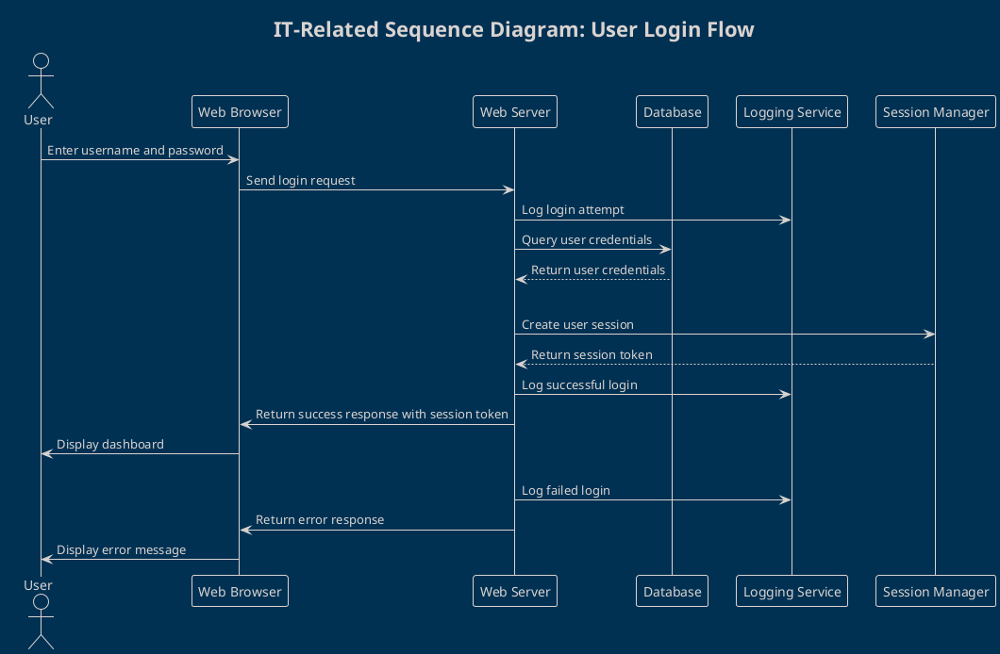
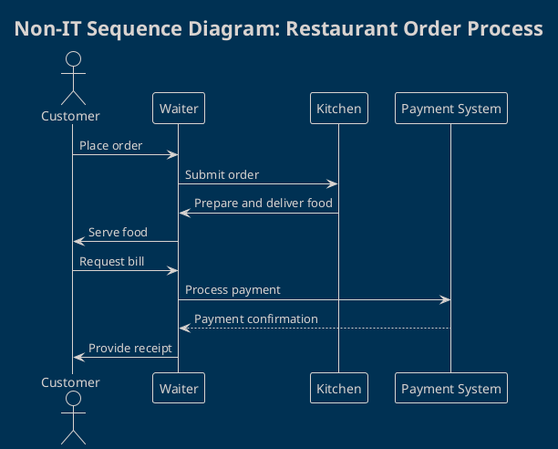
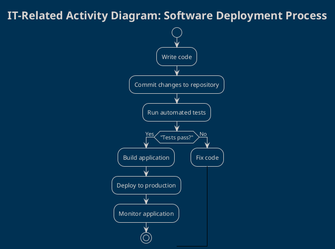
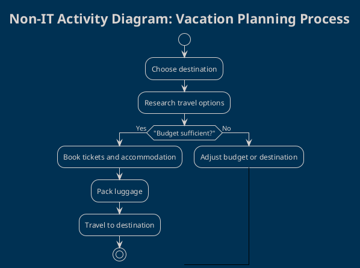

# UML Chat Designer: Comprehensive Example Library

This document provides detailed examples of UML diagrams for use with the UML Chat Designer. Each example includes:
- **Diagram Type**
- **Description**
- **Prompt** (copy and paste into the UML Chat Designer to generate the diagram)

---

## 1. IT-Related Sequence Diagram: User Login Flow

**Description:**  
This sequence diagram shows the complete process of a user logging into a web application, including all key system components: browser, server, database, logging, and session management. It covers both successful and failed login attempts, making it a great reference for authentication flows.

**Prompt:**

---

## 2. Non-IT Sequence Diagram: Restaurant Order Process

**Description:**  
This sequence diagram models the process of ordering food at a restaurant, from placing the order to payment and receipt. It clearly shows the interactions between customer, waiter, kitchen, and payment system.

**Prompt:**

---

## 3. IT-Related Activity Diagram: Software Deployment Process

**Description:**  
This activity diagram outlines the main steps in a modern software deployment pipeline, including coding, testing, building, deployment, and monitoring. It demonstrates the iterative nature of fixing code and retesting until success.

**Prompt:**

---

## 4. Non-IT Activity Diagram: Vacation Planning Process

**Description:**  
This activity diagram visualizes the process of planning a vacation, including destination selection, research, budgeting, booking, and packing. It highlights decision points and possible loops in the planning process.

**Prompt:**

---

## How to Use These Prompts

1. Open the **UML Chat Designer** in the extension.
2. Copy the desired prompt from this document.
3. Paste it into the chat input field.
4. The UML Chat Designer will generate the corresponding diagram.

Feel free to modify these prompts to fit your own scenarios!
